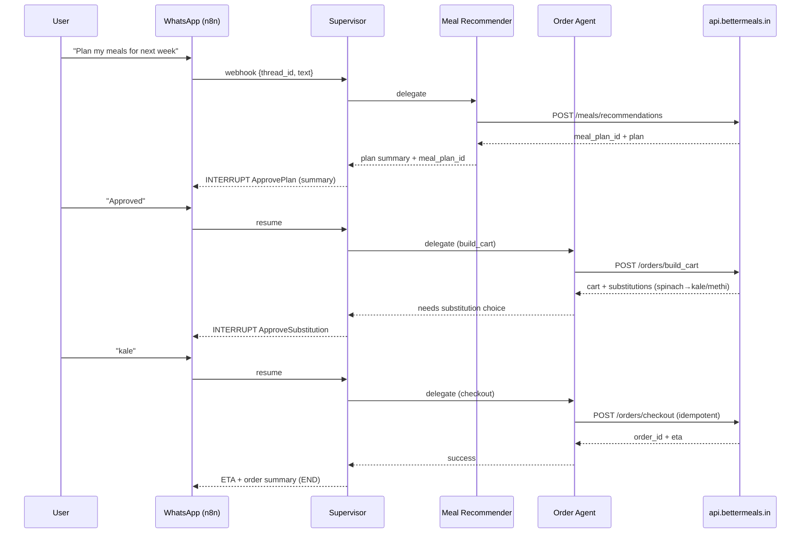
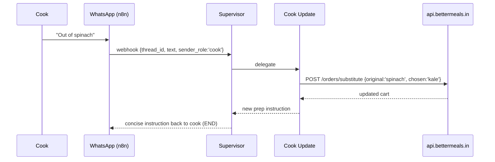

# BetterMeals :: AI Butler
### Kitchen on Autopilot

## Architecture & Behavior Overview

**One-line:** WhatsApp-first, stateful automation that turns **labs + preferences → meal plan → grocery cart → (optional) checkout**, with **human approvals**, **durable execution**, and **all domain logic behind APIs** (`api.bettermeals.in`).
**What matters:** *How it works*, not how to run it.

---

## 1) Problem & Approach

### The problem we’re solving

Households need a reliable way to go from personal health context (labs, preferences, constraints) to a weekly plan and the groceries to execute it — without endless chat or fragile spreadsheets — and with **human control** over spend and substitutions.

### The approach (in one breath)

* A **Supervisor agent** orchestrates specialized worker agents in a **LangGraph** state machine.
* All nutrition domain decisions (plan/score) and operational side-effects (orders) happen via **explicit HTTP tools** to `api.bettermeals.in`.
* The system **pauses** at critical human checkpoints (plan approval, substitutions, checkout), and **resumes** from the exact point after the user replies on WhatsApp.
* Every step is **checkpointed**, **auditable**, and **safe to replay**.

---

## 2) What Runs Where

* **WhatsApp (Meta Cloud API)** → inbound/outbound channel that users and cooks already use.
* **n8n (Integration Layer)** → receives webhooks, sanitizes & deduplicates messages, maps phone → `thread_id`, and forwards to the orchestrator; sends replies/media back to WhatsApp.
* **LangGraph Orchestrator** → houses the **Supervisor** and **specialized agents**, defines **state**, **edges**, **memory**, **streaming**, and **interrupts**.
* **BetterMeals API (`api.bettermeals.in`)** → the **source of truth** for meal planning, scoring, onboarding, and orders. LLMs never invent meals or metrics — they call these APIs.

---

## 3) The Mental Model

### 3.1 Message-passing state machine

LangGraph executes in **discrete super-steps**.
Each **Node** (agent) reads **state**, performs work, and emits **updates/messages** that activate the next node(s). A **Supervisor** decides which specialist should act next.

### 3.2 Single entry, single brain

Every inbound WhatsApp message enters the graph at `START → supervisor`. The Supervisor:

* Interprets intent,
* Delegates to exactly one specialized agent,
* Receives control back,
* Decides whether to continue, ask a question, or finish.

### 3.3 Durable by design

After each step, a **checkpoint** persists the full state + “what’s next”. Human approvals are modeled as **interrupts** that suspend execution; a later resume continues from the last checkpoint without recomputation.

---

## 4) Agents

### 4.1 Supervisor (Router & Planner of Plans)

* Reads current **thread state** and latest **message**.
* Chooses one worker to act (or asks a single clarifying question).
* Enforces **policy**: *no domain invention*, *one agent at a time*, *stop when goal satisfied*.
* Ends the run or loops again.

### 4.2 Worker Agents (API-first)

1. **Onboarding Agent**

   * Translates free text to structured payloads (household/resident updates).
   * Calls `POST /onboarding/*`.
   * Updates state with normalized identities and preferences.

2. **Meal Recommender Agent**

   * Calls `POST /meals/recommendations` with `household_id`, `date_range`, `constraints`.
   * Writes `meal_plan_id` + plan summary back to state.

3. **Meal Scoring Agent**

   * Calls `POST /meals/score` with `meal_plan_id` and requested metrics.
   * Produces an explainable “why this is good/bad” summary from API results (not invented).

4. **Order Management Agent**

   * Calls `POST /orders/build_cart` to construct the basket from a plan.
   * Handles `POST /orders/substitute` when items are missing or the cook flags issues.
   * Requests **approval** before `POST /orders/checkout` using an **idempotency key**.
   * Polls `GET /orders/status` for delivery updates.

5. **Cook Update Agent**

   * Maps cook messages like “Out of spinach” to a structured substitution request.
   * Invokes `POST /orders/substitute`, returns fresh prep instructions.

> All workers are **tool-driven** wrappers around HTTP endpoints. They **summarize & shape** responses for humans but do not create new facts.

---

## 5) Thread State & Memory

### 5.1 Thread state (short-term)

A single conversation (thread) maintains a compact state:

```ts
interface BMState {
  household_id: string;
  sender_role: 'user'|'cook';
  intent?: 'onboarding'|'recommend'|'score'|'order'|'cook_update';
  messages: Array<{role: 'user'|'assistant'|'system', content: string}>;
  api_payload?: Record<string, any>;
  api_result?: Record<string, any>;
  meal_plan_id?: string;
  pending_action?: 'approve_plan'|'approve_substitution'|'approve_checkout';
  last_error?: string;
  artifacts?: {
    meal_plan_url?: string;
    grocery_csv_url?: string;
    receipt_url?: string;
  };
}
```

* **Reducers** ensure append-only history where needed (e.g., `messages`), and simple overwrite for latest `api_result`.
* **Artifacts** are links to durable files (plan JSON, grocery CSV, receipt) stored in S3/GCS.

### 5.2 Long-term memory (cross-thread)

* **Stable preferences** (veg/non-veg, allergies), **policy rules** (no onion/garlic certain days), **cook reliability**, **common substitutions**.
* Loaded into **context** at run start; referenced but not bloating per-thread state.

---

## 6) The Happy Path (Narrative)

1. **User**: “Plan my meals for next week.”
2. **Supervisor** detects intent → **Recommender**.
3. **Recommender** calls `POST /meals/recommendations` → gets `meal_plan_id` + plan.
4. **Supervisor** raises **interrupt**: `approve_plan`. Sends a WhatsApp summary carousel + short text.
5. **User** replies “Approved.”
6. **Supervisor** resumes → **Order Agent** → `POST /orders/build_cart`.
7. API returns substitutions needed; **Supervisor** raises **interrupt**: `approve_substitution` (“Spinach unavailable; choose: kale/methi?”).
8. User selects *kale*. **Order Agent** → `POST /orders/substitute` → updates cart.
9. **Supervisor** raises **interrupt**: `approve_checkout` (“Total ₹2,150. Proceed?”).
10. User “Yes”. **Order Agent** → `POST /orders/checkout` (with idempotency key) → success; add `order_id` to state.
11. **Supervisor** fetches `GET /orders/status`, posts ETA to WhatsApp, and **ends**.

Everything above is **checkpointed** step-by-step. If the process crashes after step 9, we resume at **exactly** “awaiting checkout approval”.

---

## 7) Interrupts (Human-in-the-loop)

* **ApprovePlan** — before we commit to groceries.
* **ApproveSubstitution** — when `build_cart` detects gaps or cook flags an issue.
* **ApproveCheckout** — before spending money.

**Semantics:** An interrupt sets `pending_action=...` and returns a user-facing message.
A subsequent inbound WhatsApp message with the same `thread_id` clears `pending_action` and continues execution.

---

## 8) Streaming

Two audiences, two streams:

* **User-facing**: token-level **message streaming** while composing a summary (“Building your cart… Done.”). Improves perceived latency.
* **Ops-facing**: node-level **state updates** (“`order_agent` finished `build_cart`”, “`supervisor` awaiting approval”).

Streaming events keep the UI responsive without changing **what** happens.

---

## 9) Durability & Safety

* **Checkpoints** after each node → predictable replay.
* **Durability modes**: we use **sync** (before/after checkout), **async** for routine steps, and **exit** for cosmetic summaries.
* **Idempotency**: `orders/checkout` must accept an idempotency key so retried calls don’t double-spend.
* **Determinism**: workers never perform side effects without a recorded result; any external call’s response is persisted in `api_result`.

---

## 10) Error Handling (What happens when things go wrong)

* **API timeout** during recommendations → Supervisor apologizes, retries with backoff, or offers to continue later.
* **Substitution loop** (user rejects all options) → Supervisor escalates to **Meal Recommender** to propose a dish-level swap and restarts `build_cart`.
* **Payment unknown** after checkout → Supervisor polls `orders/status`; if still unknown, flags to human operator and suspends thread with a clear message to user.

We prefer **clear, small messages** over walls of text and always **preserve user choices** in state.

---

## 11) WhatsApp ↔ Orchestrator Contract

**Inbound (n8n → Orchestrator)**

```json
{
  "thread_id": "household_42",
  "sender_role": "user",
  "text": "Order groceries for the week",
  "mediaUrls": []
}
```

* `thread_id` maps to household or unique chat.
* Media (labs PDFs/images) arrive as URLs that the **Onboarding** path can attach to API calls.

**Outbound (Orchestrator → n8n → WhatsApp)**

* Short text updates, compact tables/carousels for menus, buttons for approvals (Y/N, option picks).
* Media links (plan JSON, grocery CSV, receipt screenshot) posted as files when relevant.

---

## 12) BetterMeals API Contracts (essentials)

> The agents are **thin clients** over these APIs. All nutrition and order truth lives here.

* **POST `/onboarding/household|resident`**
  Request: structured profile/preferences.
  Response: normalized records and IDs.

* **POST `/meals/recommendations`**
  Body: `{ household_id, date_range, constraints }`
  Response: `{ meal_plan_id, plan: [...], nutrients: {...} }`

* **POST `/meals/score`**
  Body: `{ meal_plan_id, metrics: [...] }`
  Response: `{ scores: {...}, notes: [...] }`

* **POST `/orders/build_cart`**
  Body: `{ household_id, meal_plan_id }`
  Response: `{ cart_id, items: [...], substitutions: [{need, options[]}] }`

* **POST `/orders/substitute`**
  Body: `{ cart_id, original, chosen }`
  Response: updated cart.

* **POST `/orders/checkout`**
  Body: `{ cart_id, idempotency_key }`
  Response: `{ order_id, eta, total }`

* **GET `/orders/status?order_id=…`**
  Response: `{ order_id, status, eta }`

---

## 13) Security & Privacy

* **PII minimization**: phone numbers are hashed → `household_id`.
* **Secrets**: WhatsApp tokens and any API keys are **not** stored in state; passed via runtime context only.
* **Logs**: structured, redacted (no tokens, no raw lab files).
* **Retention**: labs media auto-expire; artifacts keep references (not raw content) unless user opts in.

---

## 14) Observability & Evaluation

* **Traces** per node (Supervisor, Workers, Tools) to diagnose slow steps or tool failures.

* **Metrics**:

  * User-visible latency (time to first reply, time to completion),
  * Tool error rate,
  * Approval conversion rates,
  * Substitution loops per order,
  * Checkpoint resumes per 100 runs.

* **Qualitative**: Summaries must be **short, correct, and defer to API facts**.

---

## 15) Extensibility

* Add a **NutritionReport Agent** (e.g., weekly recap from scores).
* Swap WhatsApp for another channel (Teams/Slack) — only n8n glue changes.
* Plug in **multi-resident optimization** as a **subgraph** invoked by the Recommender.
* Slot in **vendor ranking** during `build_cart` without touching Supervisor logic.

Design rule: **new behaviors = new agents or tools**, not bigger prompts.

---

## 16) Why This Design Works

* **Separation of concerns**: Orchestration (LangGraph) vs. Domain truth (`api.bettermeals.in`).
* **Human control** at the right moments, without blocking the rest of the pipeline.
* **Resilience** via checkpoints and idempotent writes.
* **Clarity** for users (short, decisive messages) and operators (traceable state).

---

## 17) Two Canonical Sequences

### A) Plan → Approve → Cart → Approve → Checkout



### B) Cook: “Out of spinach today”



---

## 18) Principles to Keep Us Honest

1. **APIs own the truth** — LLMs orchestrate, summarize, and ask for approvals.
2. **Single decision-maker** — the Supervisor routes one worker at a time.
3. **Pause with purpose** — interruptions only at user-money or user-taste boundaries.
4. **Short messages win** — every reply should fit in one screen.
5. **Every step recoverable** — assume retries and resumes at any point.

---


`If the system were a person, the Supervisor is the coordinator, the workers are specialists with clear SOPs, and the APIs are the authoritative database of nutrition and orders.`


