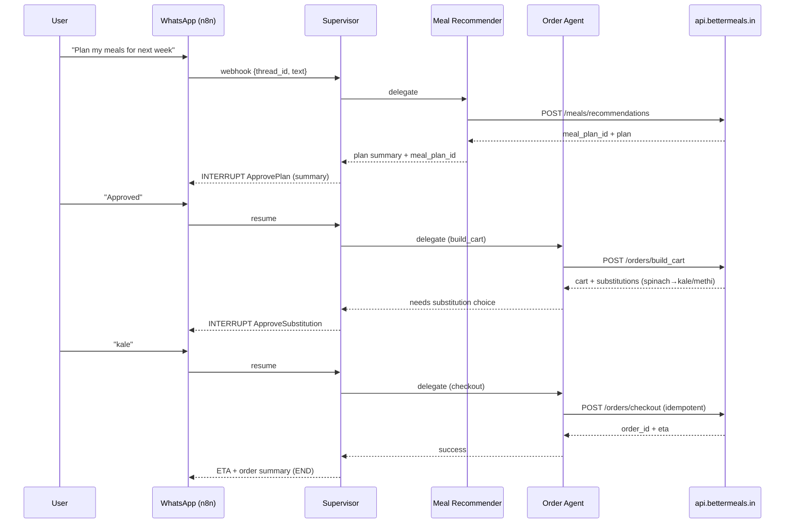
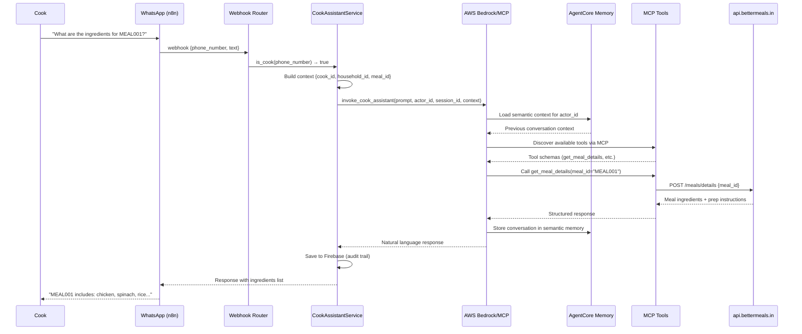

# BetterMeals :: AI Butler
### Kitchen on Autopilot

BetterMeals is an AI food assistant that runs your kitchen on autopilot. It takes lab results and household preferences, creates personalised meal plans, auto-generates grocery carts, and even briefs your cook daily via WhatsApp or voice. It adapts to different needs within the same home - like athletes, diabetics, or recovering patients — so everyone eats right without the daily hassle.

---

## Architecture & Behavior Overview

**One-line:** WhatsApp-first, stateful automation that turns  
**labs + preferences → meal plan → grocery cart → (optional) checkout**,  
with **human approvals**, **durable execution**, and **all domain logic behind APIs** (`api.bettermeals.in`).  
**What matters:** *How it works*, not how to run it.

---

## 1. Problem & Approach

### The Problem
Households need a reliable way to go from personal health context (labs, preferences, constraints) to a weekly plan and groceries — without endless chat or fragile spreadsheets — and with **human control** over spend and substitutions.

### The Approach
- A **Supervisor agent** orchestrates specialized worker agents in a **LangGraph** state machine.  
- All nutrition and ordering decisions happen via **explicit HTTP tools** to `api.bettermeals.in`.  
- The system **pauses** at human checkpoints (plan approval, substitutions, checkout) and **resumes** from the exact point after the user replies on WhatsApp.  
- Every step is **checkpointed**, **auditable**, and **safe to replay**.

---

## 2. System Components

- **WhatsApp (Meta Cloud API)** → primary inbound/outbound channel for users and cooks.  
- **n8n (Integration Layer)** → receives webhooks, deduplicates, maps phone → `thread_id`, routes to appropriate system.  
- **LangGraph Orchestrator** → hosts the Supervisor + specialized agents for structured user workflows, manages state, edges, streaming, and interrupts.  
- **AWS Bedrock/MCP (AgentCore)** → powers the Cook Assistant with Claude 3.7 Sonnet, semantic memory, and MCP tool discovery for open-ended cook conversations.  
- **BetterMeals API** → source of truth for meal planning, scoring, onboarding, and orders.
- **Tooling Standard (MCP-style descriptors)** → all HTTP tools (`onboarding.*`, `meals.*`, `orders.*`) are described with machine-readable schemas so agents can discover, validate, and audit every call (capabilities scoped per agent).

**Dual Architecture Pattern:**
- **Structured workflows** (users) → LangGraph Supervisor orchestrates deterministic, checkpointed flows
- **Open-ended conversations** (cooks) → Bedrock/MCP AgentCore provides semantic memory and tool discovery for natural Q&A


**Evaluation at a Glance**
- **Technical Excellence:** dual-architecture design (LangGraph + Bedrock/MCP), multi-agent orchestration, semantic memory, clean boundaries, typed tools, durability, tests.
- **Real-World Impact:** weekly planning → cart → checkout, human approvals, cook handoffs with natural conversation.
- **Innovation:** API-first "thin agents", dual-system routing, AgentCore semantic memory, MCP tool discovery, multi-modal intake (labs images, optional voice), resumable graph.


---

## 3. Mental Model

### Message-Passing State Machine
LangGraph runs in discrete super-steps. Each **Node** (agent) reads state, performs work, and emits updates to activate the next node(s). A **Supervisor** decides which specialist acts next.

### Single Entry, Smart Routing
All WhatsApp messages enter via the webhook layer, which performs **intelligent routing**:
- **Cook detection** → routes to Bedrock/MCP Cook Assistant (bypasses LangGraph)
- **User messages** → routes to LangGraph Supervisor
- The Supervisor:
  - Interprets intent  
  - Delegates to exactly one specialized agent  
  - Receives control back  
  - Decides to continue, ask, or finish

### Durable by Design
After each step, a **checkpoint** persists state + “what’s next”. Human approvals are **interrupts** that suspend execution; a later resume picks up exactly where it left off.

---

## 4. Agents

### LangGraph Agents (Structured Workflows)

| Agent | Responsibility |
|-------|----------------|
| **Supervisor** | Routes intent, delegates to workers, enforces policy, manages interrupts. |
| **Onboarding** | Parses free text and lab images to structured household profiles. |
| **Meal Recommender** | Calls API to generate plans and writes plan IDs to state. |
| **Meal Scorer** | Scores plans via API and explains trade-offs. |
| **Order Manager** | Builds cart, handles substitutions, manages checkout & tracking. |

### Bedrock/MCP Agent (Open-Ended Conversations)

| Agent | Responsibility |
|-------|----------------|
| **Cook Assistant** | Open-ended conversational agent powered by Claude 3.7 Sonnet via AWS Bedrock. Uses AgentCore semantic memory for context retention, MCP tool discovery for dynamic capability access, and handles cooking queries, meal details, recipe guidance, and kitchen advice. Operates independently from LangGraph with its own session management. |

> **Architecture Philosophy:** LangGraph workers are thin API-driven wrappers — they summarize & shape responses but don't invent facts. The Cook Assistant leverages Bedrock's advanced reasoning for natural conversation while maintaining tool-grounded responses.

---

## 5. State & Memory

### Short-Term (Per Thread) - LangGraph
Compact `BMState` stores household ID, role, intent, message history, API payloads/results, pending approvals, and artifact URLs (e.g., plan JSON, grocery CSV).

### Long-Term (Cross Thread) - LangGraph
Stores stable preferences (veg/non-veg, allergies), policies (no onion/garlic days), cook reliability, common substitutions.

### Semantic Memory - Cook Assistant (AgentCore)
**AgentCore semantic memory** provides persistent, actor-scoped context for cook conversations:
- **Namespace isolation**: `/facts/{actorId}` ensures cook-specific context
- **30-day retention**: Compliance-aligned event expiry
- **Session grouping**: Daily sessions (`phone_number_YYYYMMDD`) for natural conversation boundaries
- **Context injection**: Dynamic tool context (cook_id, household_id, meal_id, year_week) enhances tool calls without prompt bloat
- **Memory resource**: Managed via SSM parameters, auto-provisioned on first use

---

## 6. Happy Path (Narrative)

1. User: “Plan my meals for next week.”  
2. Supervisor detects intent → Recommender → generates plan.  
3. Supervisor interrupts for plan approval → user approves.  
4. Order Agent builds cart → detects substitutions → approval.  
5. User selects substitutions → checkout approval → success.  
6. Supervisor posts ETA → ends.

**All steps are checkpointed**. Resume after any crash without recomputation.

---

## 7. Human-in-the-Loop

- **ApprovePlan** — before committing to groceries  
- **ApproveSubstitution** — when gaps are detected  
- **ApproveCheckout** — before spending money

Interrupts set `pending_action` and pause execution until resumed.

---

## 8. Streaming

- **User-facing:** token-level streaming during summaries (e.g., “Building your cart… Done.”)  
- **Ops-facing:** node-level state updates for tracing execution

Keeps UX responsive without altering semantics.

---

## 9. Durability & Safety

- Checkpoints after each node → predictable replay  
- Sync/async durability modes  
- Idempotent checkout to avoid double-spend  
- Deterministic execution — no side-effects without persisted results

---

## 10. Error Handling

- **Timeouts** → retries with backoff or graceful suspend  
- **Substitution loops** → escalated to meal recommender  
- **Payment unknown** → polling & escalation  
Always clear, small messages; user choices preserved.

---

## 11. Interface Contracts

### Inbound (WhatsApp → Orchestrator)
```json
{
  "thread_id": "household_42",
  "sender_role": "user",
  "text": "Order groceries for the week",
  "mediaUrls": []
}
````

### Outbound (Orchestrator → WhatsApp)

* Short messages, carousels, buttons for approvals
* Media links for artifacts (plan JSON, grocery CSV, receipts)

---

## 12. API Contracts (Essentials)

| Endpoint                      | Purpose                     |
| ----------------------------- | --------------------------- |
| `POST /onboarding/*`          | Household/resident profiles |
| `POST /meals/recommendations` | Generate weekly plans       |
| `POST /meals/score`           | Score plans                 |
| `POST /orders/build_cart`     | Create grocery basket       |
| `POST /orders/substitute`     | Handle substitutions        |
| `POST /orders/checkout`       | Finalize orders             |
| `GET /orders/status`          | Track deliveries            |

---

## 13. Security & Privacy

* PII minimization (hashing IDs)
* Secrets never stored in state
* Structured, redacted logs
* Auto-expiring lab media, durable references only

**Human oversight by design:** actions with financial or dietary impact always require explicit user approval (no autonomous checkout).


---

## 14. Observability

* Per-node **traces** for diagnosing performance issues
* **Metrics**: latency, error rates, approvals, substitution loops, resumes
* Summaries must be short, correct, and API-grounded

---

## 15. Performance Benchmarks

| Metric                      | Target         |
| --------------------------- | -------------- |
| **Time to First Token**     | 150–300 ms     |
| **P95 Step Latency**        | < 2.5 s        |
| **Supervisor Loop Latency** | < 400 ms       |
| **End-to-End Flow**         | < 25 s typical |


**Measured (dev, 50 runs, local, mock APIs)**
| Metric                    | P50   | P95   |
|---------------------------|-------|-------|
| Time to First Token       | 190ms | 310ms |
| Step Latency (node+tool)  | 1.2s  | 2.3s  |
| Supervisor Loop (route)   | 180ms | 340ms |
| End-to-End (plan→cart)    | 12.4s | 21.8s |


Run:

```bash
python perf/latency_probe.py --runs 50
```

Generates CSV, histograms, and percentile summaries.

---

## 16. Real-World Impact

* Replaces messy chats/spreadsheets with structured flows
* Users stay in control at money/taste boundaries
* Cooks integrate seamlessly for substitutions
* Predictable spend via idempotent checkout
* Resumable workflows reduce friction

---

## 17) Two Canonical Sequences

### A) Plan → Approve → Cart → Approve → Checkout



### B) Cook: "What are the ingredients for meal MEAL001?"



---

## 17.5. Dual Architecture Deep Dive

### Why Two Systems?

**LangGraph (Users):** Structured, deterministic workflows with explicit state machines, checkpoints, and human-in-the-loop interrupts. Perfect for multi-step processes requiring approvals and resumability.

**Bedrock/MCP (Cooks):** Open-ended conversations requiring semantic memory, dynamic tool discovery, and natural language understanding. Cooks ask varied questions ("What can I substitute?", "How do I prep this?", "Show me this week's plan") that don't fit rigid workflows.

### Technical Highlights

**Cook Assistant Architecture:**
- **MCP (Model Context Protocol)**: Dynamic tool discovery and invocation via HTTP gateway
- **AgentCore Memory**: Semantic memory with actor-scoped namespaces, 30-day retention
- **Context Injection**: Generic context builder (`_build_tool_context`) makes available values (cook_id, household_id, meal_id, year_week) to tools without prompt engineering
- **Thread-safe Token Caching**: OAuth2 M2M flow with Cognito, cached access tokens
- **SSM Parameter Management**: Infrastructure-as-code for gateway URLs, memory IDs, Cognito configs
- **Firebase Audit Trail**: All cook conversations persisted for compliance

**Separation of Concerns:**
- Webhook layer performs routing (cook detection via Firebase lookup)
- No cross-contamination: Cook Assistant doesn't touch LangGraph state, LangGraph doesn't handle cook conversations
- Each system optimized for its use case: checkpointed workflows vs. conversational memory

---

## 18. Multi-Modal Capabilities

| Modality          | Role                             |
| ----------------- | -------------------------------- |
| Text              | Primary conversational interface |
| Vision            | Parses lab PDFs/images           |
| Speech            | Voice notes → text intents       |

Allows quick onboarding, natural conversation, and optional voice.

---

## 19. Responsible AI

* Human approvals at key boundaries
* No hallucinations — APIs own the truth
* PII minimization and deterministic execution
* Clear separation between orchestration and domain logic

---

## 20. Live Demo Guide

1. **Run Orchestrator**

   ```bash
   uvicorn src.bettermeals.entrypoints.fastapi_app:app --port 8000
   ```

2. **Use Postman Collection**

   * Send onboarding messages
   * Trigger plan → approve → cart → approve → checkout flow

3. **Observe**

   * Streaming replies
   * Interrupts for approvals
   * Logged tool calls per agent

---

## 21. Implementation Status

| Area                 | Status         | Notes                    |
| -------------------- | -------------- | ------------------------ |
| Supervisor & Workers | Complete       | LangGraph orchestration  |
| Cook Assistant       | Complete       | AWS Bedrock/MCP, AgentCore memory, MCP tool discovery |
| Tooling Layer        | Complete       | Typed API wrappers       |
| API Responses        | Complete       | Ready for live endpoints |
| Multi-Modal (Vision) | Working        | Lab intake               |
| Multi-Modal (Speech) | Working        | Demo transcription       |
| Streaming            | Working        | Token-level              |
| Semantic Memory      | Complete       | AgentCore integration with 30-day retention |
| Testing              | In progress    | Postman + pytest         |

---

## 22. Extensibility

* **New behaviors → new agents/tools** (no prompt bloat)
* **Channel expansion** (e.g., Teams, Slack) via integration layer
* **Feature growth** via subgraphs (e.g., multi-resident optimization)

---

## 23. Key Takeaways

* **Dual architecture** — LangGraph for structured workflows, Bedrock/MCP for open-ended conversations
* **Fast, stateful, real-time** orchestration with checkpointed resumability
* **Semantic memory** — AgentCore provides persistent context for cook conversations
* **Durable & auditable** execution model with Firebase audit trails
* **Multi-modal & human-centered** UX with voice, vision, and text
* **Practical impact** for households & cooks with seamless integration
* **Production-ready** — SSM-managed configs, thread-safe operations, compliance-aligned retention

---

