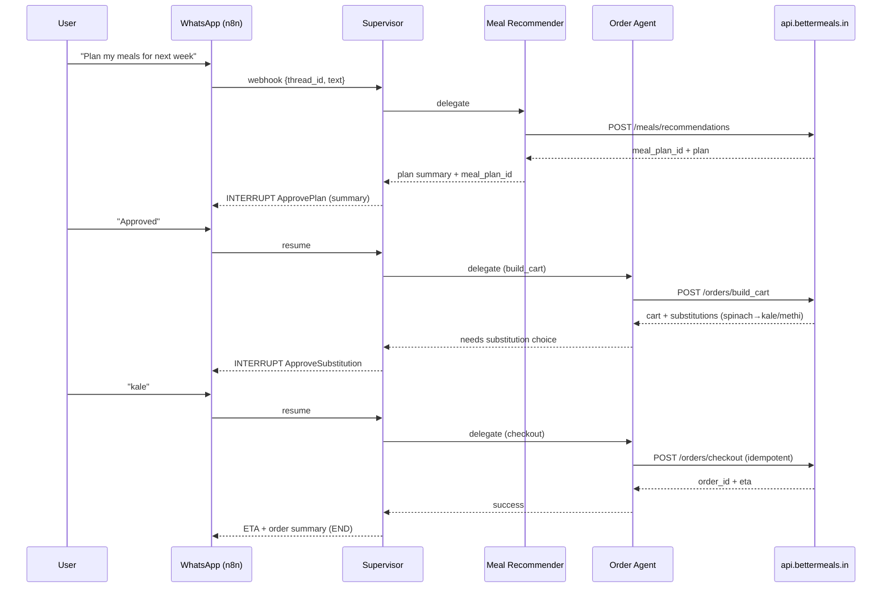
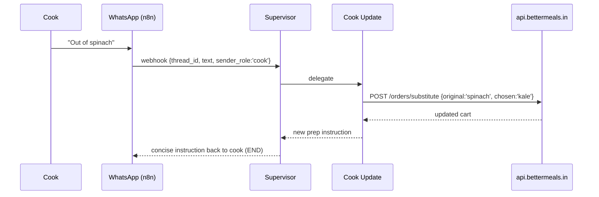

# BetterMeals :: AI Butler
### Kitchen on Autopilot

BetterMeals is an AI food assistant that runs your kitchen on autopilot. It takes lab results and household preferences, creates personalised meal plans, auto-generates grocery carts, and even briefs your cook daily via WhatsApp or voice. It adapts to different needs within the same home - like athletes, diabetics, or recovering patients — so everyone eats right without the daily hassle.

---

## Architecture & Behavior Overview

**One-line:** WhatsApp-first, stateful automation that turns  
**labs + preferences → meal plan → grocery cart → (optional) checkout**,  
with **human approvals**, **durable execution**, and **all domain logic behind APIs** (`api.bettermeals.in`).  
**What matters:** *How it works*, not how to run it.

---

## 1. Problem & Approach

### The Problem
Households need a reliable way to go from personal health context (labs, preferences, constraints) to a weekly plan and groceries — without endless chat or fragile spreadsheets — and with **human control** over spend and substitutions.

### The Approach
- A **Supervisor agent** orchestrates specialized worker agents in a **LangGraph** state machine.  
- All nutrition and ordering decisions happen via **explicit HTTP tools** to `api.bettermeals.in`.  
- The system **pauses** at human checkpoints (plan approval, substitutions, checkout) and **resumes** from the exact point after the user replies on WhatsApp.  
- Every step is **checkpointed**, **auditable**, and **safe to replay**.

---

## 2. System Components

- **WhatsApp (Meta Cloud API)** → primary inbound/outbound channel for users and cooks.  
- **n8n (Integration Layer)** → receives webhooks, deduplicates, maps phone → `thread_id`, forwards to orchestrator.  
- **LangGraph Orchestrator** → hosts the Supervisor + specialized agents, manages state, edges, streaming, and interrupts.  
- **BetterMeals API** → source of truth for meal planning, scoring, onboarding, and orders.
- **Tooling Standard (MCP-style descriptors)** → all HTTP tools (`onboarding.*`, `meals.*`, `orders.*`) are described with machine-readable schemas so agents can discover, validate, and audit every call (capabilities scoped per agent).


**Evaluation at a Glance**
- **Technical Excellence:** multi-agent orchestration, clean boundaries, typed tools, durability, tests.
- **Real-World Impact:** weekly planning → cart → checkout, human approvals, cook handoffs.
- **Innovation:** API-first “thin agents”, multi-modal intake (labs images, optional voice), resumable graph.


---

## 3. Mental Model

### Message-Passing State Machine
LangGraph runs in discrete super-steps. Each **Node** (agent) reads state, performs work, and emits updates to activate the next node(s). A **Supervisor** decides which specialist acts next.

### Single Entry, Single Brain
All WhatsApp messages enter via `START → supervisor`. The Supervisor:
- Interprets intent  
- Delegates to exactly one specialized agent  
- Receives control back  
- Decides to continue, ask, or finish

### Durable by Design
After each step, a **checkpoint** persists state + “what’s next”. Human approvals are **interrupts** that suspend execution; a later resume picks up exactly where it left off.

---

## 4. Agents

| Agent | Responsibility |
|-------|----------------|
| **Supervisor** | Routes intent, delegates to workers, enforces policy, manages interrupts. |
| **Onboarding** | Parses free text and lab images to structured household profiles. |
| **Meal Recommender** | Calls API to generate plans and writes plan IDs to state. |
| **Meal Scorer** | Scores plans via API and explains trade-offs. |
| **Order Manager** | Builds cart, handles substitutions, manages checkout & tracking. |
| **Cook Update** | Translates cook WhatsApp messages into structured substitutions. |

> All workers are thin API-driven wrappers — they summarize & shape responses but don’t invent facts.

---

## 5. State & Memory

### Short-Term (Per Thread)
Compact `BMState` stores household ID, role, intent, message history, API payloads/results, pending approvals, and artifact URLs (e.g., plan JSON, grocery CSV).

### Long-Term (Cross Thread)
Stores stable preferences (veg/non-veg, allergies), policies (no onion/garlic days), cook reliability, common substitutions.

---

## 6. Happy Path (Narrative)

1. User: “Plan my meals for next week.”  
2. Supervisor detects intent → Recommender → generates plan.  
3. Supervisor interrupts for plan approval → user approves.  
4. Order Agent builds cart → detects substitutions → approval.  
5. User selects substitutions → checkout approval → success.  
6. Supervisor posts ETA → ends.

**All steps are checkpointed**. Resume after any crash without recomputation.

---

## 7. Human-in-the-Loop

- **ApprovePlan** — before committing to groceries  
- **ApproveSubstitution** — when gaps are detected  
- **ApproveCheckout** — before spending money

Interrupts set `pending_action` and pause execution until resumed.

---

## 8. Streaming

- **User-facing:** token-level streaming during summaries (e.g., “Building your cart… Done.”)  
- **Ops-facing:** node-level state updates for tracing execution

Keeps UX responsive without altering semantics.

---

## 9. Durability & Safety

- Checkpoints after each node → predictable replay  
- Sync/async durability modes  
- Idempotent checkout to avoid double-spend  
- Deterministic execution — no side-effects without persisted results

---

## 10. Error Handling

- **Timeouts** → retries with backoff or graceful suspend  
- **Substitution loops** → escalated to meal recommender  
- **Payment unknown** → polling & escalation  
Always clear, small messages; user choices preserved.

---

## 11. Interface Contracts

### Inbound (WhatsApp → Orchestrator)
```json
{
  "thread_id": "household_42",
  "sender_role": "user",
  "text": "Order groceries for the week",
  "mediaUrls": []
}
````

### Outbound (Orchestrator → WhatsApp)

* Short messages, carousels, buttons for approvals
* Media links for artifacts (plan JSON, grocery CSV, receipts)

---

## 12. API Contracts (Essentials)

| Endpoint                      | Purpose                     |
| ----------------------------- | --------------------------- |
| `POST /onboarding/*`          | Household/resident profiles |
| `POST /meals/recommendations` | Generate weekly plans       |
| `POST /meals/score`           | Score plans                 |
| `POST /orders/build_cart`     | Create grocery basket       |
| `POST /orders/substitute`     | Handle substitutions        |
| `POST /orders/checkout`       | Finalize orders             |
| `GET /orders/status`          | Track deliveries            |

---

## 13. Security & Privacy

* PII minimization (hashing IDs)
* Secrets never stored in state
* Structured, redacted logs
* Auto-expiring lab media, durable references only

**Human oversight by design:** actions with financial or dietary impact always require explicit user approval (no autonomous checkout).


---

## 14. Observability

* Per-node **traces** for diagnosing performance issues
* **Metrics**: latency, error rates, approvals, substitution loops, resumes
* Summaries must be short, correct, and API-grounded

---

## 15. Performance Benchmarks

| Metric                      | Target         |
| --------------------------- | -------------- |
| **Time to First Token**     | 150–300 ms     |
| **P95 Step Latency**        | < 2.5 s        |
| **Supervisor Loop Latency** | < 400 ms       |
| **End-to-End Flow**         | < 25 s typical |


**Measured (dev, 50 runs, local, mock APIs)**
| Metric                    | P50   | P95   |
|---------------------------|-------|-------|
| Time to First Token       | 190ms | 310ms |
| Step Latency (node+tool)  | 1.2s  | 2.3s  |
| Supervisor Loop (route)   | 180ms | 340ms |
| End-to-End (plan→cart)    | 12.4s | 21.8s |


Run:

```bash
python perf/latency_probe.py --runs 50
```

Generates CSV, histograms, and percentile summaries.

---

## 16. Real-World Impact

* Replaces messy chats/spreadsheets with structured flows
* Users stay in control at money/taste boundaries
* Cooks integrate seamlessly for substitutions
* Predictable spend via idempotent checkout
* Resumable workflows reduce friction

---

## 17) Two Canonical Sequences

### A) Plan → Approve → Cart → Approve → Checkout



### B) Cook: “Out of spinach today”



---

## 17. Multi-Modal Capabilities

| Modality          | Role                             |
| ----------------- | -------------------------------- |
| Text              | Primary conversational interface |
| Vision            | Parses lab PDFs/images           |
| Speech            | Voice notes → text intents       |

Allows quick onboarding, natural conversation, and optional voice.

---

## 18. Responsible AI

* Human approvals at key boundaries
* No hallucinations — APIs own the truth
* PII minimization and deterministic execution
* Clear separation between orchestration and domain logic

---

## 19. Live Demo Guide

1. **Run Orchestrator**

   ```bash
   uvicorn src.bettermeals.entrypoints.fastapi_app:app --port 8000
   ```

2. **Use Postman Collection**

   * Send onboarding messages
   * Trigger plan → approve → cart → approve → checkout flow

3. **Observe**

   * Streaming replies
   * Interrupts for approvals
   * Logged tool calls per agent

---

## 20. Implementation Status

| Area                 | Status         | Notes                    |
| -------------------- | -------------- | ------------------------ |
| Supervisor & Workers | Complete       | LangGraph orchestration  |
| Tooling Layer        | Complete       | Typed API wrappers       |
| API Responses        | Complete       | Ready for live endpoints |
| Multi-Modal (Vision) | Working        | Lab intake               |
| Multi-Modal (Speech) | Working        | Demo transcription       |
| Streaming            | Working        | Token-level              |
| Testing              | In progress    | Postman + pytest         |

---

## 21. Extensibility

* **New behaviors → new agents/tools** (no prompt bloat)
* **Channel expansion** (e.g., Teams, Slack) via integration layer
* **Feature growth** via subgraphs (e.g., multi-resident optimization)

---

## 22. Key Takeaways

* **Fast, stateful, real-time** orchestration
* **Durable & auditable** execution model
* **Multi-modal & human-centered** UX
* **Practical impact** for households & cooks

---

